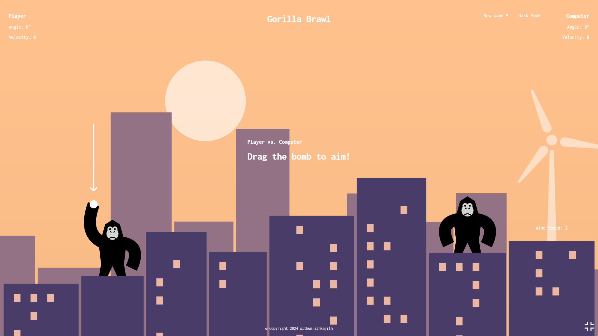
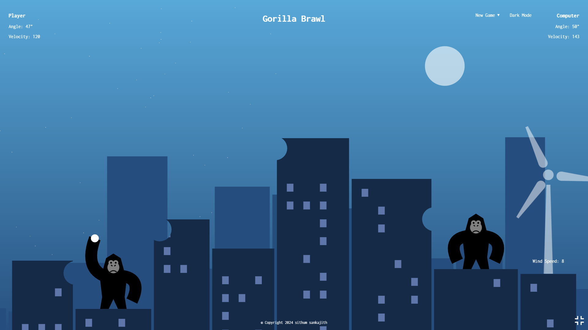

# Gorilla Brawl

Gorilla Brawl is a turn-based artillery game inspired by Qbasic-Gorillas, created using HTML, CSS, and JavaScript. The game features two modes: day mode and night mode, adding a dynamic visual element to the gameplay. Players can adjust the angle and velocity of their gorilla's throws to hit the opponent gorilla across the city skyline.

## Features
- Two playable modes: day and night
- Adjustable angle and velocity for throws
- Dynamic city skyline backdrop

## How to Play
- Use the mouse or touchpad to adjust the angle and velocity of your throw.
- Click or tap to launch the banana towards your opponent.
- Try to hit your opponent gorilla before they hit you to win the game.

## Demo
[Play Gorilla Brawl](link_to_play_game)

## Screenshots

## Technologies Used
- HTML
- CSS
- JavaScript
